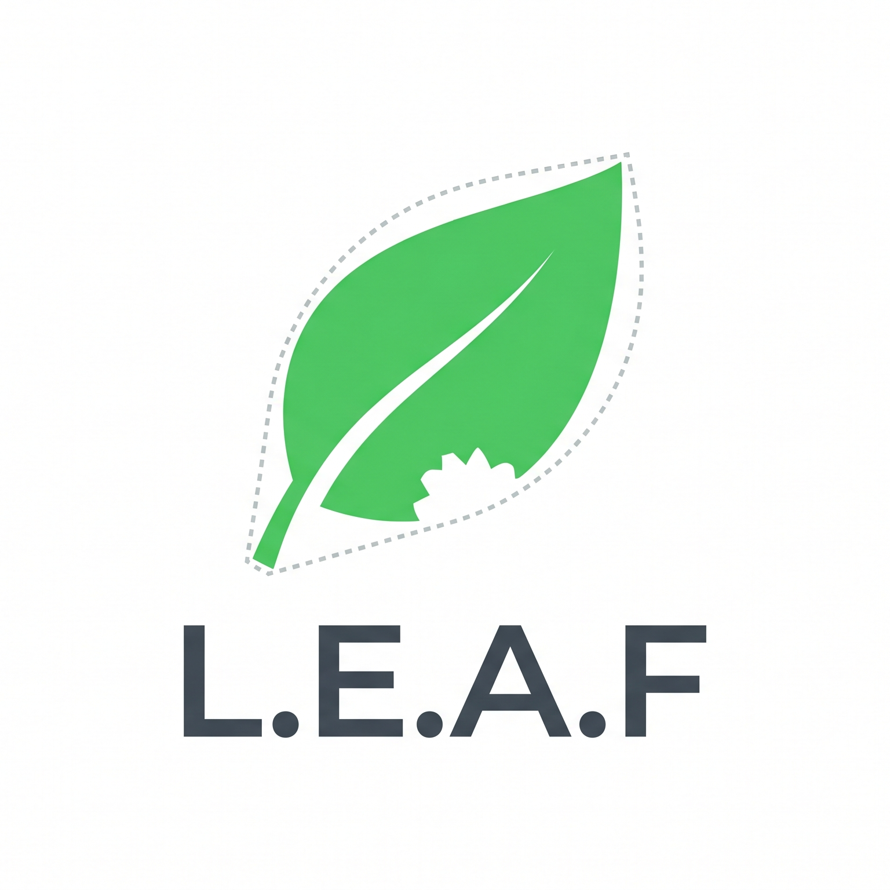

# 🌿 LEAF — Levantamento e Estimativa de Anomalias Foliares

> **LEAF** é uma aplicação desktop nativa para análise de imagens de folhas, construída em **Python + CustomTkinter**. Utiliza um pipeline avançado de Processamento Digital de Imagens (PDI) com **OpenCV** para segmentação foliar, estimativa de herbivoria, detecção de doenças e cálculo de métricas fitométricas — tudo em uma interface premium estilo AgriTech/SaaS.

<p align="center">
  
</p>

---

## 👥 Autores

Projeto desenvolvido como requisito acadêmico para a disciplina de **Engenharia de Prompt e Aplicações em IA**.

*   **Albert William Silva Cunha**
*   **Lais Bembo De Freitas**
*   **Felipe**
*   **Daniela**
*   **Amanda Albuquerque Silva**

---

## 💻 Sobre o Projeto

O **LEAF** atua como uma ferramenta de apoio (protótipo acadêmico) para triagem visual na área agronômica. Através do processamento de imagens utilizando limiarização em espaços de cores HSV e CIELAB, a aplicação separa tecido saudável de tecido com sintomas de doenças, estresse ou danos por herbivoria.

### Principais Funcionalidades

| Funcionalidade | Descrição |
|---|---|
| 📸 **Upload e Processamento** | Análise em lote de imagens foliares com barra de progresso em tempo real |
| 🎯 **Isolamento de Fundo (GrabCut)** | Algoritmo de segmentação automática foreground/background para excluir pixels do fundo |
| 🧬 **Watershed** | Separação automática de folhas encostadas via Distance Transform + Watershed |
| 🔢 **Detecção Multi-Folha** | Identifica e numera cada folha individualmente, gerando métricas separadas por folha |
| 🎛️ **Calibração Avançada** | Controle granular de limites de cor (HSV/LAB), filtros morfológicos, nível GrabCut e PPM |
| 📊 **Dashboard Analítico** | Exibição imediata de Herbivoria (%), Severidade (%), Confiança e Resumo de Severidade |
| 📐 **Estimativa de Área** | Conversão de pixels para cm² baseada no fator PPM (Pixels Per Metric) |
| 🕒 **Histórico Persistente** | Todas as análises são salvas automaticamente em JSON e sobrevivem entre sessões |
| 📄 **Exportação** | Relatórios em CSV e JSON com metadados completos para reprodutibilidade científica |
| 🗂️ **Banco de Imagens Kaggle** | Download e navegação do dataset "New Plant Diseases" (38 categorias, ~87K imagens) diretamente no app |
| 🌙 **Tema Claro/Escuro** | Toggle manual de tema com cores adaptáveis em toda a interface |

---

## 🛠️ Tecnologias Utilizadas

| Tecnologia | Função |
|---|---|
| **Python 3.11+** | Linguagem principal |
| **CustomTkinter** | Interface desktop nativa (sem servidor web) |
| **OpenCV (`cv2`)** | Pipeline de PDI: GrabCut, Watershed, Distance Transform, morfologia |
| **NumPy** | Computação matricial de alta performance |
| **Pandas** | Manipulação de histórico e exportação CSV |
| **Pillow (PIL)** | Carregamento de imagens e conversão para thumbnails |
| **KaggleHub** | Download automatizado do dataset de doenças foliares |
| **PyInstaller** | Empacotamento como executável `.exe` standalone |

---

## 🏗️ Arquitetura

```text
leaf_app/
├── main.py                    # Ponto de entrada da aplicação
├── main_window.py             # Janela principal (CTk) + roteamento de páginas
├── image_processor.py         # Pipeline de PDI: HSV/LAB, GrabCut, Watershed, Overlay
├── background_removal.py      # Módulo de isolamento de fundo via GrabCut + ROI automático
├── metrics.py                 # Cálculos fitométricos (herbivoria, severidade, área em cm²)
├── dataset_manager.py         # Gerenciador do dataset Kaggle (download, cache, listagem)
├── logo.png                   # Logo 1:1 recortada exibida na sidebar
├── icon.ico                   # Ícone do executável (multi-resolução)
└── ui/
    ├── theme.py               # Design System (cores, fontes, layout)
    ├── state.py               # Estado global + persistência JSON do histórico
    ├── sidebar.py             # Sidebar com navegação e toggle de tema
    ├── pages/
    │   ├── dashboard.py       # Página principal (upload, análise, preview, métricas)
    │   ├── dataset_browser.py # Navegador do dataset Kaggle com thumbnails
    │   ├── history.py         # Tabela de histórico com exportação CSV
    │   ├── reports.py         # Relatórios consolidados + galeria visual
    │   └── settings.py        # Configurações avançadas (HSV, LAB, GrabCut, PPM)
    └── components/
        ├── preview_card.py    # Card de preview do overlay
        ├── metric_card.py     # Cards de métricas individuais
        └── summary_card.py    # Card de resumo com barra de severidade
```

---

## 🚀 Como Executar

### Pré-requisitos
* Python 3.11 ou superior
* Pip instalado

### Instalação e Execução

```bash
# 1. Clone o repositório
git clone https://github.com/Lbfte/eng-de-prompt.git
cd eng-de-prompt

# 2. Instale as dependências
pip install customtkinter opencv-python numpy pandas pillow kagglehub

# 3. Execute o software
cd leaf_app
python main.py
```

### Gerar Executável (.exe)

```bash
# Na raiz do projeto
pip install pyinstaller
pyinstaller launcher.spec --clean
```

O executável será gerado em `dist/LEAF.exe` — totalmente standalone, sem necessidade de Python instalado.

---

## 📊 Pipeline de Processamento de Imagem

O LEAF executa o seguinte pipeline para cada imagem:

```
Imagem → Decodificação BGR
  │
  ├─ [Opcional] GrabCut (isolamento de fundo)
  │   ├─ Threshold de Otsu + contornos → ROI automático combinado
  │   ├─ GrabCut iterativo (GMM)
  │   └─ Pós-processamento: morfologia + componentes conectados
  │
  ├─ Conversão HSV ou CIELAB
  ├─ Limiarização: máscara saudável + máscara sintomática
  ├─ [Se GrabCut ativo] bitwise_and com fg_mask
  │
  ├─ Reconstrução da silhueta: Convex Hull ou Fechamento Morfológico
  │
  ├─ [Se múltiplas folhas] Watershed + Distance Transform
  │   ├─ Separação de folhas encostadas
  │   └─ Métricas individuais por folha
  │
  ├─ Cálculo de métricas: Herbivoria%, Severidade%, Área em cm²
  │
  └─ Overlay visual: contornos, numeração, fundo escurecido
```

---

## 🗂️ Banco de Imagens Kaggle

O LEAF integra o dataset **"New Plant Diseases Dataset"** do Kaggle (vipoooool), com ~87.000 imagens em 38 categorias:

* Acesse a aba **"Banco de Imagens"** na sidebar
* Clique em **"Baixar Dataset"** (download de ~350 MB, apenas pasta de validação)
* Navegue categorias como `Apple - Apple scab`, `Tomato - Late blight`, etc.
* Selecione múltiplas imagens com checkboxes
* Clique em **"Analisar selecionadas"** — o LEAF processará automaticamente

---

## ⚠️ Observação Importante

O **LEAF** é um **protótipo acadêmico** para triagem visual. Os resultados representam estimativas calculadas por algoritmos de processamento de imagem e **não** constituem diagnóstico fitossanitário definitivo emitido por um profissional da agronomia.

---

📅 *Projeto entregue para a Avaliação Prática de Engenharia de Prompt e Aplicações em IA.*